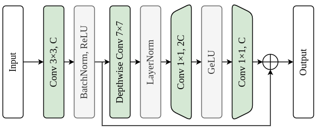

# CompSegNet: An enhanced U-shaped architecture for nuclei segmentation in H&amp;E histopathology images

## 1. Abstract
<div align="justify"> 
In histopathology, nuclei within images hold vital diagnostic information. Automated segmentation of nuclei can alleviate pathologists' workload and enhance diagnostic accuracy. Although U-Net-based methods are prevalent, they face challenges like overfitting and limited field-of-view. This paper introduces a new U-shaped architecture (CompSegNet) for nuclei segmentation in H&amp;E histopathology images by developing enhanced convolutional blocks and a Residual Bottleneck Transformer (RBT) block. The proposed convolutional blocks are designed by enhancing the Mobile Convolution (MBConv) block through a receptive fields enlargement strategy, which we referred to as the Zoom-Filter-Rescale (ZFR) strategy and a global context modeling based on the global context (GC) Block;  and the proposed RBT block is developed by incorporating the Transformer encoder blocks in a tailored manner to a variant of the Sandglass block. Additionally, a noise-aware stem block and a weighted joint loss function are designed to improve the overall segmentation performance. The proposed CompSegNet outperforms existing methods quantitatively and qualitatively, achieving a competitive AJI score of 0.705 on the MoNuSeg 2018 dataset, 0.72 on the CoNSeP dataset, and 0.779 on the CPM-17 dataset while maintaining a reasonable parameter count.
</div>

## 2. Architecture
### 2.1 Overall Architecture
<p align="center">
   
</p>

### 2.2 Architecture Specifications
<p align="center">
   
</p>

### 2.3 Building Blocks
#### CompSeg (CSeg) Block
<div align="justify"> 
  
- Enhances MBConv efficiency through the Zoom-Filter-Rescale (ZFR) strategy.
- Involves:
  - Large stride at the entry expansion layer (*Zooming*).
  - Large kernel-sized depthwise convolution operation (*Zooming and Filtering*).
  - Rescaling spatial size using bilinear upsampling to compensate for downsampling (*Rescaling*).
- Increases receptive fields within MBConv by 8×.
- Decreases inference latency by approximately 30%.

</div>

<p align="center">
   
</p>

#### Extended CompSeg (ECSeg) Block
<div align="justify">

- Extends the CSeg block by incorporating an improved global context (IGC) block for robust global context modeling.
- Increases AJI score of the nuclei segmentation on MoNuSeg 2018 dataset in a lightweight network by approximately 1.9%.
- Achieves improved performance with only a minimal computational cost.

</div>

<p align="center">
   
</p>

#### Residual Bottleneck Transformer (RBT) Block
<div align="justify">
  
- Incorporates Transformer encoder blocks in a tailored manner to a variant of the Sandglass block.
- Leverages strengths of both convolutional and attention-based mechanisms.
- Effectively captures fine-grained spatial information and comprehensive long-range dependencies.

</div>

<p align="center">
   
</p>

#### Noise-aware stem (Block) Block
<div align="justify">
  
- Stem block 
- Enhances low-level feature extraction while mitigating the impact of noisy features in the model's initial skip connections.  
  
</div>
<p align="center">
   
</p>

## 3. Implementation
<div align="justify">
The proposed architecture is implemented using the Keras API with a TensorFlow 2.12 backend, running on a Google Colab Pro+ instance equipped with an Intel(R) Xeon(R) CPU and an NVIDIA A100-SXM4-40GB GPU.

### 3.1 Clone the project
For cloning the project run:  
```bash
   $ git clone https://github.com/mltraore/compsegnet.git
   $ cd compsegnet
```
### 3.2 Install requirements
Install requirements using:  
```bash
   $ chmod +x install_dependencies.sh
   $ pip install -r requirements.txt
   $ sudo ./install_dependencies.sh
```

### 3.2 Datasets
The following datasets were used in experiments:

- [MoNuSeg 2018](https://monuseg.grand-challenge.org/Data/)
- [CoNSeP](https://drive.google.com/file/d/1rpIDWxhiM_pt25lpcqTdVC3MCmQncYcX/view)
- [CPM-17](https://drive.google.com/open?id=1l55cv3DuY-f7-JotDN7N5nbNnjbLWchK)

Processed versions of these datasets, along with the original versions, predicted masks, and a checkpoint sample for the MoNuSeg 2018 dataset, can be downloaded [here](https://drive.google.com/drive/folders/1ikOYp_37YUczyncHvmSpVoL4PQuz7zkm?usp=sharing). For automatic download, run:  
```bash
   $ chmod +x download_resources.sh
   $ ./download_resources.sh
```
in the project directory.  

- Note: The included predicted masks are actual CompSegNet architecture outputs, provided for qualitative comparison and further evaluation by the authors in their research.

To create the datasets yourself, use the *prepare_dataset.py* script:
```bash
# Get script usage info
$ python3 prepare_dataset.py --help

# Example usage
$ python3 prepare_dataset.py --dataset-path datasets/monuseg_2018 \
                             --image-size 1000 \
                             --validation-size 0.10 \
                             --reference-image datasets/monuseg_2018/train/images/1.tif \
                             --prepared-data-path datasets/prepared_datasets/monuseg_2018
```

### 3.3 Training
Use the *train.py* script in the project directory to train the model:
```bash
# Get script usage info
$ python3 train.py --help

# Example usage
$ python3 train.py --train-folder datasets/prepared_datasets/monuseg_2018/train \
                   --validation-folder datasets/prepared_datasets/monuseg_2018/validation \
                   --checkpoints-folder checkpoints/ckpts
```

### 3.4 Testing 
Use the *test.py* script in the project directory to test the model:
```bash
# Get script usage info
$ python3 test.py --help

# Example usage
$ python3 test.py --model-weights-save checkpoints/ckpts \
                  --test-set datasets/prepared_datasets/monuseg_2018/train
```
This provides Dice Similarity Coefficient (DSC), Aggregated Jaccard Index (AJI), and Hausdorff Distance (HD) scores.
</div>

## 4. Results
### 4.1 Quantitative Results
 &nbsp;&nbsp;**CompSegNet on MoNuSeg 2018 dataset**
<p align="center">
   
</p>

 &nbsp;&nbsp;**CompSegNet on CoNSeP dataset**
<p align="center">
   
</p>

 &nbsp;&nbsp;**CompSegNet on CPM-17 dataset**
<p align="center">
   
</p>

### 4.2 Qualitative Results
 &nbsp;&nbsp;**CompSegNet on MoNuSeg 2018 dataset**
<p align="center">
   
</p>

 &nbsp;&nbsp;**CompSegNet on CoNSeP dataset**
<p align="center">
   
</p>

 &nbsp;&nbsp;**CompSegNet on CPM-17 dataset**
<p align="center">
   
</p>

## Citation

## Acknowledgement
This work is supported by TÜBİTAK (Scientific and Technological Research Council of Türkiye) (Project number: 121E379).
